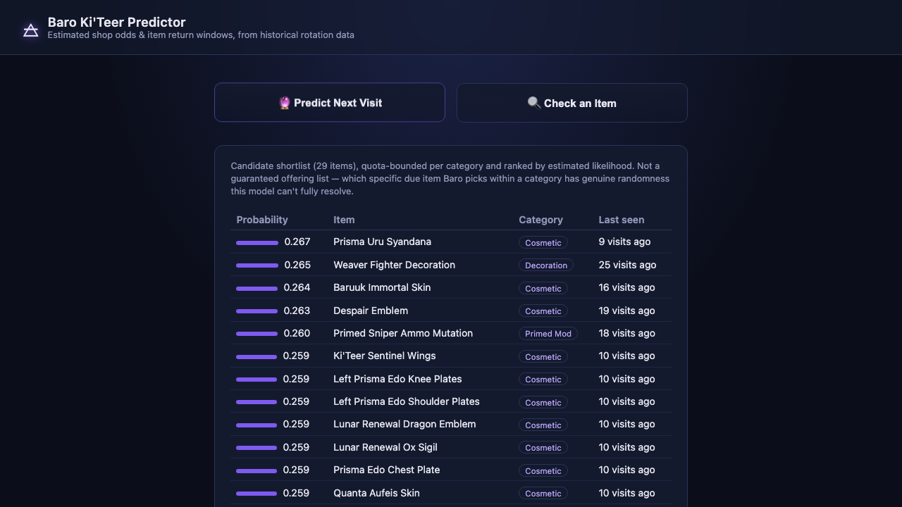
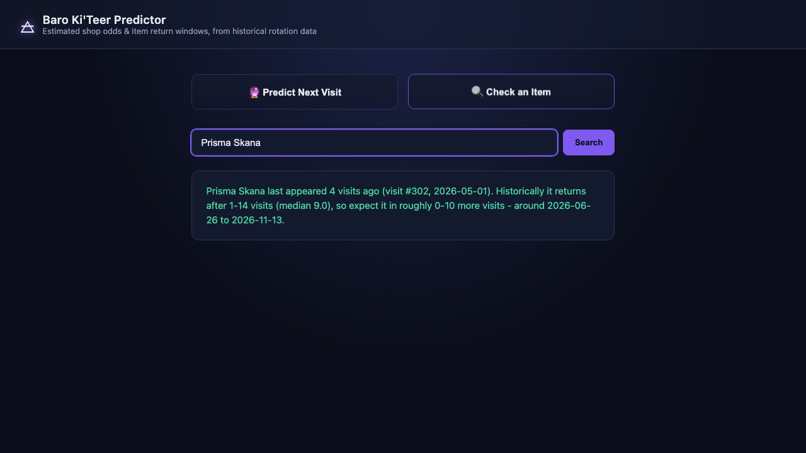

# Baro Ki'Teer Predictor

Baro Ki'Teer is a traveling merchant in [Warframe](https://www.warframe.com/) who shows up every
~2 weeks with a rotating stock pulled from a pool of 450+ items. This project scrapes his full
historical offering data, models the rotation statistically, and serves two predictions through a
small local web app:

1. **Next-visit shortlist** — which items are most likely to be in his shop next time.
2. **Item ETA lookup** — for any specific item, an estimate of when it'll come back around.

Both are built on real historical data (back to Baro's introduction in 2014) and both are honest
about their limits — see [How it works](#how-it-works) for the actual numbers, including where
the models *don't* do better than a coin flip and why.




## Quick start

```bash
pip install -r requirements.txt

# one-time (or occasional) backfill of the full historical dataset
python3 scrape_baro_data_module.py

# start the app
python3 -m uvicorn app:app
```

Then open `http://127.0.0.1:8000`.

## How it works

### Item ETA (`eta_model.py`)

For an item with **3 or more** recorded appearances, this looks at the gaps (in visits) between
its own past appearances and reports the empirical min/median/max as an estimated return window,
plus whether it's currently "overdue" relative to its own history.

For items with fewer than 3 appearances, there's deliberately **no prediction** — just the raw
facts (which visits it appeared at). Manufacturing a confident-sounding estimate from 0-2 data
points would just be noise dressed up as a number.

### Next-visit shortlist (`ranking_model.py`)

This one pools data across all ~450 items to fit a single empirical **hazard curve**: for every
item, "how long since its last appearance, relative to its own typical gap" is turned into a
probability of reappearing at the very next visit, using the pooled reappearance-rate pattern
across every item's full history. On top of that, since Baro's shop draws a roughly fixed count
per item *subtype* each visit (e.g. always 3-8 Primed Mods total, but also always just 1-2
Cosmetic Syandanas specifically, separate from Cosmetic Armor's own count), the model estimates a
per-subtype quota from a rolling window of recent visits and allocates the shortlist against a
fixed overall budget (~40 items, matching a typical real visit's size) - well-evidenced subtypes
keep their full deserved quota, and the long tail of rarely-seen subtypes only get a slot if
there's budget left after that, weakest evidence dropped first. This avoids two failure modes:
one subtype (e.g. a multi-piece armor set that's always offered together) crowding out everything
else in a shared bucket, and the shortlist ballooning past a real visit's size by guaranteeing
every rare subtype a slot regardless of budget.

Backtested against the last 20 real visits (refitting the model with only data available before
each one, so there's no lookahead):

| Metric | Model | Random baseline |
|---|---|---|
| Precision @ ~40-item shortlist | 0.104 | ~0.08 |
| Recall @ top 100 candidates | 0.314 | 0.224 |
| Recall @ top 200 candidates | 0.639 | 0.447 |

**Read that honestly**: the model narrows ~450 items down to a meaningfully smaller likely set
(40-50% better than chance at wider cutoffs), but naming the *exact* ~30-40 items Baro will pick
has a low ceiling — there's genuine randomness in which specific "due" item gets chosen within a
subtype that elapsed-time-based features can't fully resolve. The shortlist is a probability
ranking, not a guaranteed offering list.

## Project structure

| File | Purpose |
|---|---|
| `lua_table_parser.py` | Minimal parser for the Lua table syntax used by the wiki's data module |
| `scrape_baro_data_module.py` | Full historical backfill: scrapes `Module:Baro/data`, builds `baro.db` |
| `poll_baro_visits.py` | Polls the live Warframe worldstate API, records new visits incrementally |
| `eta_model.py` | Purpose 2 - per-item ETA prediction |
| `ranking_model.py` | Purpose 1 - next-visit shortlist prediction |
| `app.py` | FastAPI app wiring both models into HTTP endpoints, serves the frontend |
| `static/index.html` | Frontend - two buttons, an autocomplete item search, no framework |
| `baro.db` | SQLite database (generated - not meant to be hand-edited) |

### Database schema

```
items        (item_id, name, item_type, release_date, tradable, discontinued, always_available)
visits       (visit_id, date, relay_location)
visit_items  (visit_id, item_id, ducats, credits)
```

`discontinued` items (flagged by the wiki as retired) are excluded from future predictions but
keep their historical record. `always_available` items (e.g. Sands of Inaros Blueprint) are
offered at every visit and excluded from the rotation models entirely, since they're not a
prediction problem.

## Keeping the data current

- **`scrape_baro_data_module.py`** rebuilds the full historical dataset from the wiki every time
  it runs. Simplest option if you use this occasionally - just re-run it before you need
  predictions, regardless of how long it's been.
- **`poll_baro_visits.py`** captures whatever Baro is doing *right now* from the live API. Useful
  for continuous/frequent use to catch a visit before the wiki gets updated, but it can't
  retroactively fill in visits you missed - it's not a substitute for the backfill script after a
  long gap.

To run the poller automatically, a cron entry works well:

```cron
0 */6 * * * /usr/bin/python3 /path/to/baro_app/poll_baro_visits.py >> /path/to/baro_app/poll.log 2>&1
```

> **Note for macOS users:** keep the project outside of TCC-protected folders (`Documents`,
> `Desktop`, `Downloads`, etc.) if you plan to run this from cron - background processes can be
> silently blocked from reading/writing there otherwise. `~/Developer` or `~/code` work fine.

## Data sources

- Historical offerings: [`Module:Baro/data`](https://wiki.warframe.com/w/Module:Baro/data) on the
  Warframe Wiki - the structured source the wiki's own trade tables are generated from.
- Live status: [`api.warframestat.us`](https://docs.warframestat.us/) (the `/pc/voidTrader`
  endpoint), maintained by the Warframe Community Developers (WFCD).

## Tech stack

Python (stdlib `sqlite3`, no ML framework - the models are hand-rolled empirical statistics),
FastAPI + uvicorn for the API, vanilla HTML/CSS/JS for the frontend. No build step.
